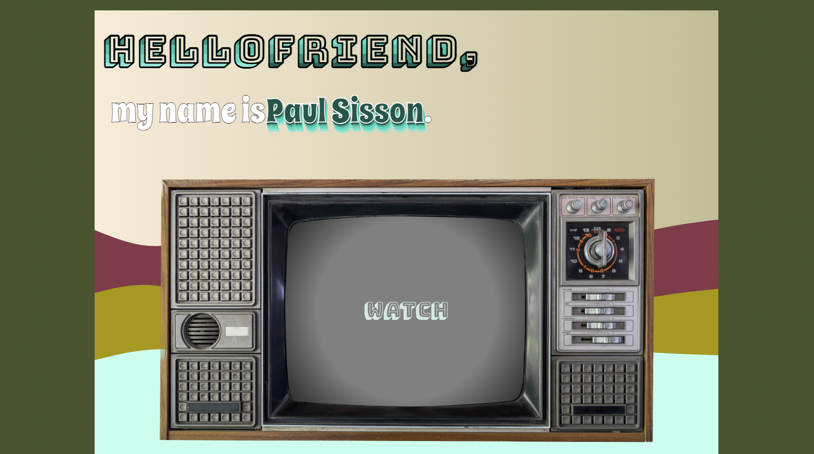

# ***[Retrofolio](https://jpaulsisson.netlify.app/)***

*It's like retro-portfolio.*

### Preview

### Things I learned: 
  - Sass and the power/fun of CSS
  - IntersectionObserver (even though it's use was abandoned for now)
  - DOM traversal and manipulation
  - Gaining more and more comfort with React/React Hooks
  - More practice with React's Context API
  - Linking to common contact forms directly (phone, email, other sites in new tabs)
  - Comfort working with images

---

### Challenges I faced while building this:
  1. Design. I wish I had worked from a wireframe instead of winging it.
  2. Loops in Sass, the syntax was a little wonky
  3. Learning Intersection Observer
  4. Responsively sizing fonts and images
  5. Organization from start to finish (an unusual struggle for me)
  6. Pseudo-elements

--- 

### Tech I used: 

[Haikei SVG Generator](https://app.haikei.app/)

---

### Things I'm proud of: 
  * Everything I wanted to try, I figured out. 
  * It's fun and that's what I wanted.
  * I gained so much comfort through building this.
  * My growth, from the first site I built to this, in such a short time.